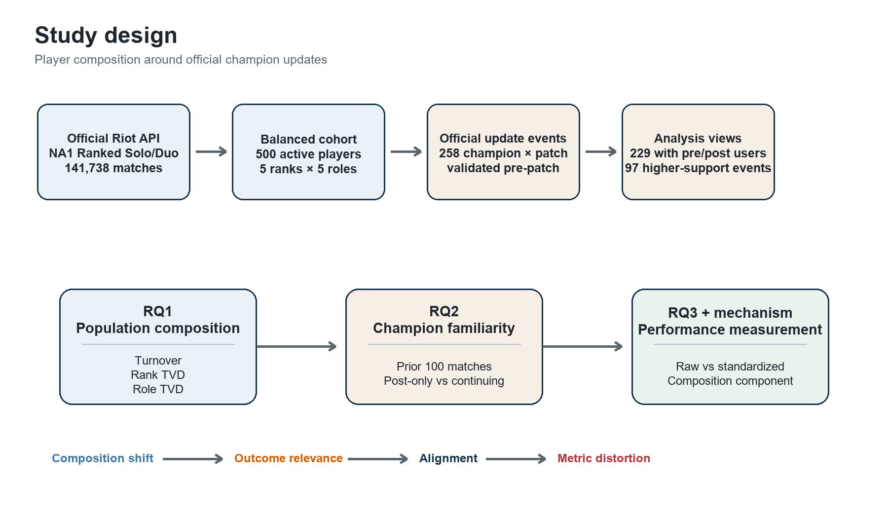
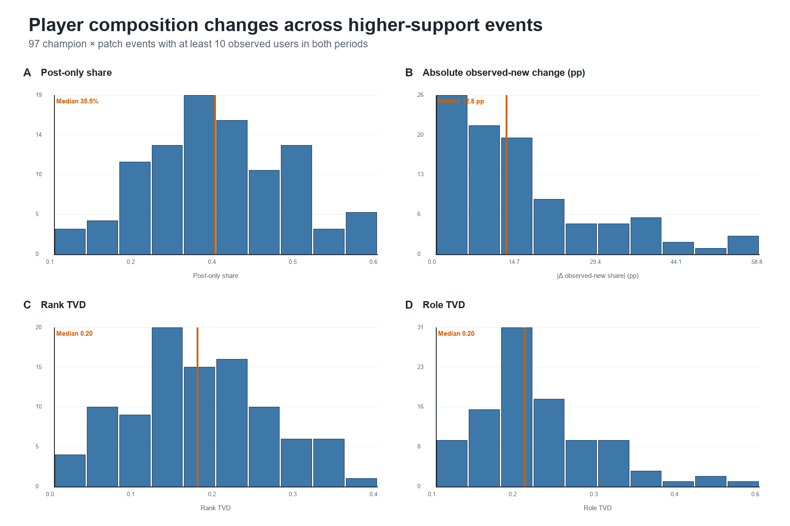
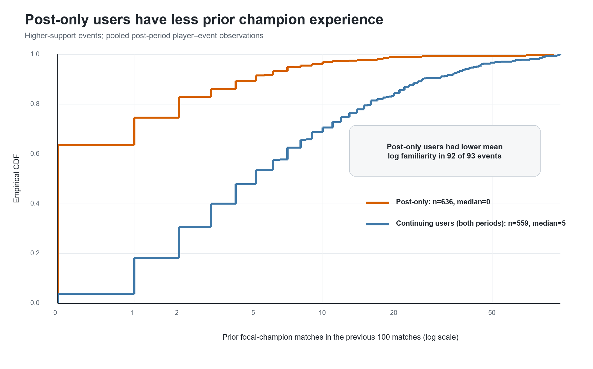
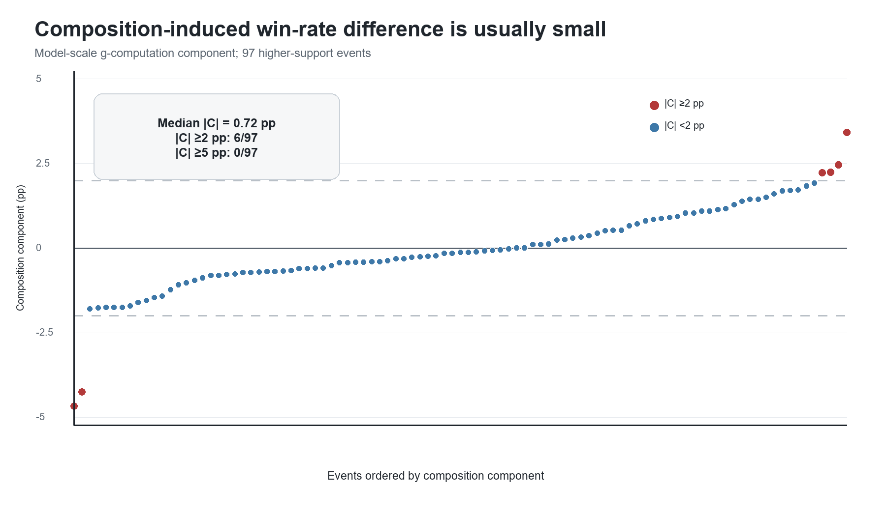

# Who Plays Changes, but Does It Matter?

## Player Composition Around League of Legends Updates

> **Who plays changes a lot—but, for win rate, it matters less than expected.**

League of Legends updates are often evaluated through aggregate performance metrics such as champion win rate. But the players using a champion before and after an update may not be the same population. A change in aggregate win rate can therefore reflect both gameplay changes and a changing mix of users.

This project asks two connected questions: **How much does the player population change around champion updates, and how much does that change alter the measurement of win-rate differences?** The analysis separates population instability from metric instability rather than assuming that one implies the other.

## Study design



The study uses a fixed, rank × role balanced cohort from the NA1 Ranked Solo/Duo queue. Official champion-update events are paired with their immediately preceding patch. The main descriptive view retains events with at least 10 observed focal-champion users in both periods.

## Data

- **500** active ranked players
- **141,738** Ranked Solo/Duo matches
- **258** official champion × patch events
- **229** events with focal-champion users in both pre and post periods
- **97** higher-support events used in the main figures
- **100 previous matches** as the primary familiarity window
- **50 previous matches** as a sensitivity window

The cohort contains 100 players from each of five rank strata—Gold, Platinum, Emerald, Diamond, and Master+—with 20 players per primary role within each stratum. The balanced cohort supports comparisons across rank and role, but it is not intended to reproduce the natural NA1 player distribution.

## RQ1 — Who plays changes



Player composition often changed around official champion updates. Across the 97 higher-support events:

- the median post-only share of the pre/post user union was **35.5%**;
- the median absolute change in observed-new share was **12.8 percentage points**;
- median rank Total Variation Distance was **0.20**;
- median role Total Variation Distance was **0.20**.

Here, **post-only** means that a player was observed using the focal champion after the update but not in its pre-period. **Observed-new** means no focal-champion use was found in the recorded familiarity window. Neither term implies first lifetime use.

## RQ2 — Newly observed users are less experienced



The changing user population had a clear experience structure:

- post-only users had lower mean log familiarity than continuing users in **92 of 93** comparable events;
- the pooled median was **0** prior focal-champion matches for post-only users;
- the pooled median was **5** for continuing users observed in both periods.

The turnover is structured with respect to observed champion familiarity: users entering the observed champion pool after an update were systematically less familiar with that champion within the available match history.

## RQ3 — Win-rate measurement is comparatively robust



The analysis then compared observed win-rate change with a composition-standardized difference. Standardization used continuous log familiarity, rank, and primary role, with the post-update outcome surface evaluated over the pre-update covariate distribution.

Across the 97 higher-support events:

- median absolute composition component was **0.72 percentage points**;
- **6 of 97** events had an absolute component of at least 2 pp;
- **0 of 97** reached 5 pp;
- raw and standardized changes reversed direction in **2 of 97** events.

Interaction, nonlinear-familiarity, player-balanced, weighting, and 50-match-window specifications showed the same overall pattern of modest composition adjustment. Ridge regularization was retained as a sensitivity diagnostic because it also shrinks event-specific post-update contrasts and is not a direct estimate of composition adjustment.

## Mechanism

The model-scale g-computation decomposition is:

```text
model raw difference = standardized difference + composition component
```

The identity closes to numerical precision for every event. The median absolute residual between the observed and model-implied raw difference is 0.0000 pp, so the small adjustment is not an artifact of comparing incompatible quantities.

The mechanism is more specific than “large shift × weak association.” Familiarity moved substantially, but its predicted win-probability contrast was small. Role had a larger potential outcome contrast, but the observed role shifts did not consistently move along that outcome gradient. Distribution distance and potential outcome sensitivity were therefore insufficient on their own.

> **Population instability and metric instability are distinct. Distribution shift affects an aggregate metric only when the shifting attributes are outcome-relevant and the distribution moves along that outcome gradient.**

This distinction may also be relevant to other live-service settings where aggregate metrics are compared across changing populations. Detecting population turnover is an important diagnostic, but it is not itself evidence that the metric has become materially distorted.

## What this project does not show

- It does **not** identify the causal effect of a champion balance change.
- It evaluates **win rate**; other outcomes may respond differently to population change.
- Standardization uses observed familiarity, rank, and role. Unobserved player traits may still matter.
- The balanced 500-player cohort is an analytic sampling frame, not an estimate of the natural NA1 population distribution.
- “Observed-new” and “post-only” are defined from recorded match history and do not identify true first-time champion users.
- Continuing-user estimates are supplementary because repeated-user support is sparse in many events.

## Main outputs

The frozen main-text package is in [`results/main/`](results/main/):

- [`figure1_study_design.png`](results/main/figure1_study_design.png)
- [`figure2_composition_shift.png`](results/main/figure2_composition_shift.png)
- [`figure3_familiarity_ecdf.png`](results/main/figure3_familiarity_ecdf.png)
- [`figure4_composition_component.png`](results/main/figure4_composition_component.png)
- [`main_tables.md`](results/main/main_tables.md)
- [`figure_captions.md`](results/main/figure_captions.md)

Additional boundary-condition analyses, estimator diagnostics, and continuing-user checks are retained as tabular or intermediate analysis outputs in their corresponding directories, but they are not part of the four-figure main narrative.

## Repository structure

```text
.
├── docs/                                    # Frozen plan, direction, and study narrative
├── data/
│   ├── official_changed_champion_patch_table.csv
│   └── processed/                           # De-identified match and cohort analysis inputs
├── src/                                     # Collection, analysis, robustness, and figure scripts
├── tests/                                   # 43 unit tests
└── results/
    ├── main/                                # Four main figures, three tables, and captions
    └── rq1/ ... mechanism/                  # Auditable stage-level outputs
```

## Data availability

Raw Riot account identifiers are not distributed. De-identified processed inputs and anonymized analysis outputs required to inspect and reproduce the reported results are included. Rebuilding the full dataset requires a new API collection under the documented sampling procedure.

## Reproducibility

Dependencies are listed in [`requirements.txt`](requirements.txt). With the included de-identified match table, anonymized cohort metadata, and official changed-champion event table, the frozen analysis sequence is:

```bash
python src/rq1_composition_analysis.py
python src/rq2_experience_shift_analysis.py
python src/rq3_performance_standardization.py
python src/rq3_robustness_analysis.py --bootstrap-reps 1000
python src/rq4_boundary_condition_analysis.py
python src/mechanism_analysis.py
python src/build_final_main_text.py
python -m unittest discover -s tests -t . -v
```

The current test suite contains **43 tests** covering cohort reuse, event construction, familiarity windows, distribution metrics, standardization helpers, robustness weights, and mechanism utilities.

### Rebuilding data from the Riot API

API collection reads the key only from the `RIOT_API_KEY` environment variable:

```powershell
$Env:RIOT_API_KEY = "your-current-development-key"
```

API keys, `.env` files, PUUID-bearing cohort files, raw response caches, checkpoints, and request logs are excluded through [`.gitignore`](.gitignore). The collection code includes caching, retry with exponential backoff, and explicit handling of HTTP 429 responses. No API key is written to scripts, reports, CSV files, logs, or cached responses.

The included processed inputs reproduce the reported analysis without account identifiers. Rebuilding the dataset from a fresh API pull requires constructing an equivalent cohort under the documented rank × role sampling design; the source account identifiers remain private.

## Scope

This is a public game analytics research project focused on measurement in live-service games. It does not build a churn model, predict individual match outcomes, or rank champions. Its contribution is a reproducible distinction between changing player populations and changing aggregate performance measurements.

## Riot Games Disclaimer

Who Plays Changes, but Does It Matter? Player Composition Around League of Legends Updates is not endorsed by Riot Games and does not reflect the views or opinions of Riot Games or anyone officially involved in producing or managing Riot Games properties. Riot Games and all associated properties are trademarks or registered trademarks of Riot Games, Inc
